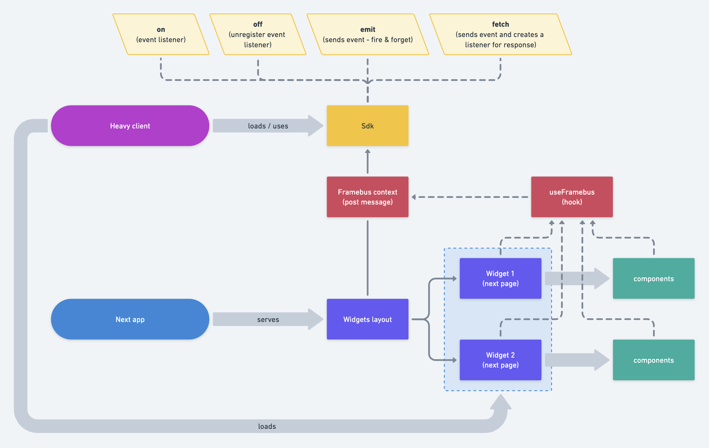

# sdk-test

This is a POC for the integration of a web app into a heavy client. The heavy client part can be found [here](https://github.com/jpb06/sdk-test-java-app).

# Next app

Our next app will expose several pages. Each page can be seen as an independent feature block (called widget) that can be loaded in an oustide context (like a heavy client app, for example).

# Communication



To communicate with the outside context, [fseglard](https://github.com/fseglard) has written a sdk based on [post message api](https://developer.mozilla.org/en-US/docs/Web/API/Window/postMessage).

## Sdk API

### `init`

The `init` function replaces an element in the DOM with an iframe that will target one of our next app widget pages.

```tsx
<div id="my-widget" />
<script src="/libs/sdk.min.js" />
<script>
  const widget = new window.WidgetSdk({
    baseUrl: 'http://localhost:3000',
    frameHeight: 600,
    frameWidth: 900,
    theme: 'neutral',
    token: 'my-token',
    type: 'user',
  });

  widget.init('my-widget');
</script>
```

### `emit`

The `emit` function sends an event:

```typescript
const framebus = useFramebusContext();

const handleClick = () => {
  framebus.emit('user.actions.doStuff', {
    payload: {
      id: 126
      name: 'Yolo bro',
    },
  });
};
```

### `on`

The `on` function creates a listener for an event type:

```typescript
const framebus = useFramebusContext();

useEffect(() => {
  framebus.on('user.get', ({ id }) => {
    console.info(`user.get event fired with id ${id}`);
    // ...
  });
}, [framebus]);
```
